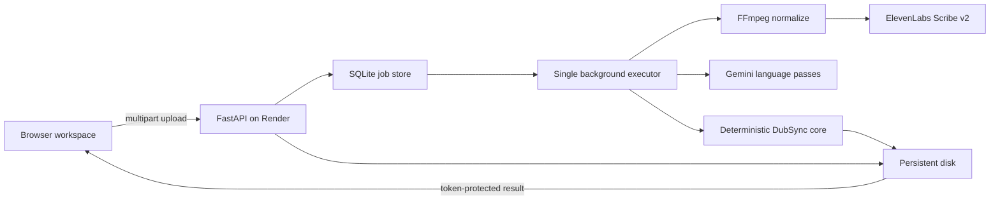

# DubSync Commercial MVP Plan

**Status:** implemented locally; deployment configuration validated as of 2026-07-11  
**Engine contract:** `PLAN.md` remains authoritative for subtitle timing and reconciliation behavior.  
**Product contact:** reyhanputraph@gmail.com

## 1. Product decision

DubSync should be a focused production utility, not a broad editing SaaS.

Its promise is: upload dialogue audio with an existing SRT to repair timing, or upload audio alone to generate a timed SRT. In both workflows, timing comes from acoustic word timestamps. Language models may reason about words, punctuation, and speaker context, but never create timestamps.

Primary customers:

- Freelance subtitle and dubbing professionals.
- Small localization studios.
- Post-production teams receiving VO-only dubbed audio and unreliable target-language SRT timing.

The first commercial version intentionally has no accounts, subscriptions, collaboration workspace, browser subtitle editor, or Supabase dependency. Those features add operational and legal surface before they improve the core transaction.

## 2. Implemented MVP

### Customer workflows

1. **Sync existing SRT**
   - Upload dialogue audio and an original SRT.
   - Preserve unchanged cue text and segmentation.
   - Re-time cues from word timestamps.
   - Reconcile spoken differences and improvised lines.
   - Keep speaker changes separate.
   - Download the synced SRT, QC JSON, QC HTML, and text-change SRT when available.

2. **Generate from audio**
   - Upload dialogue audio without an SRT.
   - Group words by silence, duration, line capacity, sentence ending, and known speaker change.
   - Snap generated cues to the selected frame grid.
   - Apply the guarded punctuation pass when enabled.
   - Download the generated SRT and QC artifacts.

### Commercial surface

- Clean responsive React workspace and complete landing content.
- Pricing, features, FAQ, contact, Terms of Service, and Privacy Policy.
- Job status and protected downloads.
- Secret 256-bit job tokens; only token hashes are stored.
- Tab-scoped job recovery after refresh.
- Strict extension, content-type, empty-file, and byte-limit validation.
- Five jobs per source IP per hour by default.
- Files and metadata expire after 24 hours, with an independent cleanup timer.
- Security headers and a strict Content Security Policy.
- No advertising analytics, account cookies, or billing integration.

## 3. Architecture



### Why this is the correct first deployment

- One Render service owns the API, worker, SQLite metadata, uploads, and results.
- A persistent disk makes queued jobs and files survive restarts.
- Processing occurs outside the request that creates the job.
- The architecture is inexpensive, understandable, and sufficient for early-access demand.
- Supabase adds no necessary capability at this stage.

### Known constraint

A Render persistent disk is attached to one service instance. This prevents horizontal scaling and zero-downtime deploys. That is acceptable for the MVP, but not for sustained concurrent demand.

### Scaling trigger

Move to shared infrastructure when any two of these are true for two consecutive weeks:

- More than three jobs are regularly queued at once.
- P95 queue wait exceeds ten minutes.
- The disk remains above 70% utilization.
- Deployment downtime interrupts paid work.
- More than 20 customers need persistent history or team access.

The next architecture should use Render Postgres for metadata, Render Key Value or Render Workflows for durable execution, and S3-compatible object storage for media. Use Supabase only if its combined authentication and customer-data tooling is specifically preferred over Render Postgres; it is not required by the product.

## 4. Render deployment

The repository includes a Docker multi-stage build and `render.yaml` Blueprint:

- Region: Singapore.
- Web service: Starter, one instance.
- Persistent disk: 10 GB.
- Health check: `/api/health`.
- Shutdown timing: Render-managed because custom shutdown delay is unsupported for services with a disk.
- Secrets: `ELEVENLABS_API_KEY` and `GEMINI_API_KEY`, entered in Render only.
- Runtime data: `/var/data`.

Current baseline infrastructure cost:

| Item | Current price | Monthly baseline |
|---|---:|---:|
| Render Starter service | $7/month | $7.00 |
| Render persistent SSD | $0.25/GB/month | $2.50 for 10 GB |
| Total before bandwidth and providers |  | **$9.50/month** |

Render includes 5 GB of monthly bandwidth on the Hobby workspace, then charges $0.15/GB. DubSync normalizes source audio to 16 kHz mono before provider upload, which materially reduces service-initiated bandwidth.

Local release verification validated `render.yaml` against Render's published JSON Schema. A container build and external Blueprint deployment were not run because this machine has no Docker engine, Render CLI, usable Git repository, or connected remote.

## 5. Pricing and margin policy

Published early-access prices:

| Workflow | Customer price | Minimum | Availability |
|---|---:|---:|---|
| Audio to SRT | $0.12/min | $3 | Available |
| Sync existing SRT | $0.18/min | $5 | Available |
| Precision processing | $0.25/min | $10 | Sell only after live forced-alignment validation |

Current provider price anchors:

- ElevenLabs Scribe v1/v2: $0.22/hour, or $0.27/hour when keyterm prompting adds $0.05/hour.
- Gemini 3.5 Flash paid tier: $1.50 per million input tokens and $9 per million output tokens.
- Every job already writes measured provider cost to `cost.json`; this is the source of truth for repricing.

Margin rule:

```text
job contribution = quoted price - measured provider cost - allocated Render cost - payment fee - refund/support reserve
```

Target at least 70% gross margin after variable provider and infrastructure allocation. Review prices after the first 50 paid jobs and then quarterly. Minimum charges are important because setup, upload, support, and failure handling are mostly per job rather than per minute.

Do not introduce subscriptions yet. Start with manual quotes or one-time payment links once payments are enabled. Add subscriptions only after recurring use proves that customers prefer monthly commitments over per-job pricing.

## 6. Feature roadmap

### Next: high-value workflow improvements

1. **Preflight and quote**
   - Validate audio with `ffprobe` before queueing provider work.
   - Show duration, selected rate, estimated price, and expected deletion time before submission.

2. **Names and keyterms**
   - Let customers add character names, fantasy terms, ranks, and brand vocabulary.
   - Feed them to Scribe keyterm prompting and record the surcharge in the quote.

3. **Customer style sample**
   - Accept an optional sample SRT.
   - Derive a temporary style profile for that job.
   - Show the detected FPS, line limit, and minimum duration before processing.

4. **Safe retry**
   - Expose a retry command for failed jobs.
   - Resume from the last complete stage instead of repeating paid provider calls.

5. **Batch delivery**
   - Upload multiple matched SRT/audio pairs.
   - Return one ZIP with results and a batch summary.
   - Keep each episode isolated so one failure does not discard successful jobs.

### Later: only after revenue validates demand

- Customer accounts and persistent job history.
- One-time payments, then optional subscriptions.
- Team workspaces and shared style profiles.
- Object storage plus horizontally scalable workers.
- API keys and webhooks for studio automation.
- A cue review editor only if QC downloads prove insufficient.

## 7. Launch gates

Before accepting paid customer media:

- Put the project in a real private Git repository and connect it to Render.
- Validate the Blueprint with the Render CLI or API.
- Set paid ElevenLabs and Gemini credentials in Render.
- Run one live generate job and one live sync job through the web route.
- Confirm provider data settings and contract terms appropriate for customer media.
- Add uptime/error alerts and disk-usage alerts.
- Confirm the operator legal name, business address, Indonesian governing-law choice, refund policy, and tax handling with qualified counsel/accounting advice.
- Replace manual pricing copy only when a working payment path exists.
- Keep a human-review warning visible in Terms and delivery documentation.

## 8. Product metrics

Track operational data without retaining customer dialogue:

- Job success rate by workflow.
- Queue wait and processing duration.
- Provider cost per source minute.
- Failure stage and retry success.
- Number of QC flags per 100 cues.
- Refunds and support minutes per job.
- Repeat-customer rate.

Do not log transcript text, API keys, job tokens, uploaded filenames, or raw provider responses into general application logs.

## 9. Current-source references

- Render pricing: https://render.com/pricing
- Render persistent disks: https://render.com/docs/disks
- Render Blueprint specification: https://render.com/docs/blueprint-spec
- ElevenLabs API pricing: https://elevenlabs.io/pricing/api
- Gemini API pricing: https://ai.google.dev/gemini-api/docs/pricing
- Gemini data retention: https://ai.google.dev/gemini-api/docs/zdr
